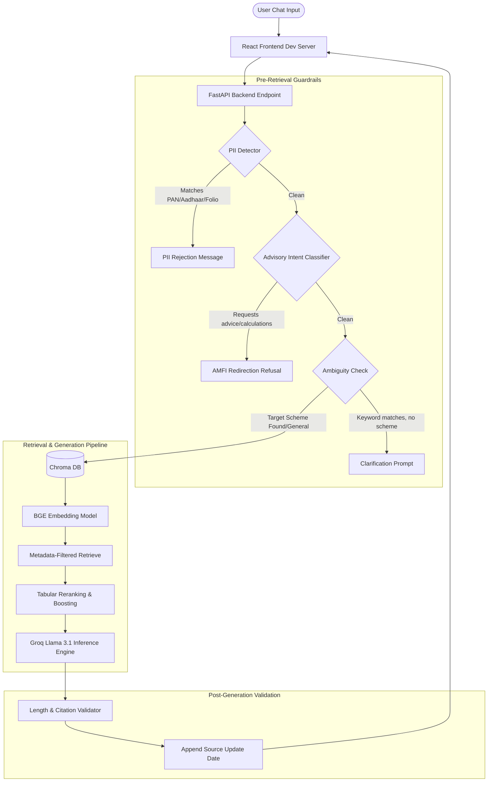

# Facts-Only Mutual Fund FAQ Assistant (RAG Chat Bot)

An enterprise-grade, compliance-first Retrieval-Augmented Generation (RAG) assistant for mutual fund queries. Built with **FastAPI**, **React (Vite)**, **Chroma DB**, and **Groq (Llama 3.1)**, it is specifically configured to provide facts-only Q&A for HDFC Mutual Fund schemes while strictly adhering to SEBI/AMFI financial advisory compliance guidelines.

### 🌐 Live Production Demo
*   **Web Application (Vercel)**: [https://mutual-fund-assistant-rag-chat-bot.vercel.app/](https://mutual-fund-assistant-rag-chat-bot.vercel.app/)
*   **API Service (Railway)**: [https://mutual-fund-assistant-rag-chat-bot-production.up.railway.app/](https://mutual-fund-assistant-rag-chat-bot-production.up.railway.app/)

---

## 🌟 Key Features

*   **Compliance-First Architecture:** Bypasses LLM generation and handles rejections at the API boundary when advisory or out-of-scope intent is detected.
*   **PII Leakage Interception:** Pre-retrieval middleware regex scanner that immediately intercepts and rejects queries containing sensitive data (PAN, Aadhaar, Folio numbers, emails, phone numbers).
*   **Advisory Intent Guardrail:** Programmatic and semantic LLM classification blocks investment suggestions, returns/performance calculations, and CAGR estimations, redirecting users to official sources.
*   **Ambiguity Resolution:** Automatically detects scheme-specific terms (e.g. exit load, NAV, SIP) without a target fund and requests clarification from the user with a list of the 5 supported schemes.
*   **Factual Hallucination Prevention:** Truncates LLM responses to a maximum of 3 sentences, validates citation URLs against context metadata, and automatically appends a standard "Last updated" footer.
*   **Premium Groww-Inspired UI:** Dark slate dashboard built with custom HSL Vanilla CSS, containing dynamic glassmorphic chat bubbles, interactive quick-start cards, and live API connection status indicators.

---

## 🏗️ System Architecture



---

## 📂 Project Directory Structure

```text
├── .github/                  
│   └── workflows/
│       └── ingest_scheduler.yml  # Daily data ingestion workflow
├── raw_data/                 # Downloaded PDFs and parsed HTML guides
├── parsed_data/              # Isolated markdown table factsheets
├── ingestion/                # Offline ETL pipeline scripts
│   ├── download.py           # Document download utility
│   ├── parser.py             # Table formatting & HTML/PDF parser
│   └── index.py              # Semantic chunker & Chroma DB indexer
├── backend/                  # FastAPI Backend API Server
│   ├── main.py               # Main app routing & endpoints
│   ├── config.py             # dotenv configuration file
│   ├── guardrails.py         # PII regex scanner & advisory classifier
│   ├── retrieval.py          # Vector query & scheme context isolate
│   ├── generation.py         # Prompt formulation & Groq LLM caller
│   └── validator.py          # Sentence limits & link sanitization
├── frontend/                 # Premium React UI (Vite)
│   ├── src/
│   │   ├── components/       # WelcomeScreen & ChatWindow
│   │   ├── App.jsx           # Main UI container & health checker
│   │   ├── index.css         # Groww HSL styling tokens
│   │   └── main.jsx
│   ├── package.json
│   └── index.html
├── tests/                    # Unified Test Suites
│   ├── verify_phase1.py      # Noise elimination & Chroma check
│   ├── test_backend.py       # API response & guardrail checks
│   └── verify_compliance.py  # 65-test-case RAG compliance runner
└── docs/                     # Architecture & context specifications
```

---

## ⚙️ Installation & Setup

### Prerequisite: Set Environment Variables
Create a file named `.env` in the root directory and add your Groq API key:
```env
GROQ_API_KEY=gsk_your_groq_api_key_here
```

### 1. Backend Service Setup (Python 3.10+)
Install the required packages from the root directory:
```bash
pip install -r backend/requirements.txt
```

### 2. Frontend Web App Setup (Node.js)
Navigate to the `frontend/` folder and install NPM packages:
```bash
cd frontend
npm install
```

---

## 🚀 Running the Project

### Step 1: Start the Backend Service
Execute the uvicorn API server from the root directory:
```bash
python -m backend.main
```
The FastAPI server will boot up at `http://127.0.0.1:8000`.

### Step 2: Start the React Frontend Web App
In a new terminal window, navigate to the `frontend/` directory and launch Vite:
```bash
cd frontend
npm run dev
```
The frontend application will boot up at `http://localhost:5173`. Open this URL in your browser to start chatting.

---

## 🧪 Running Verification Tests

The project includes pre-built test suites inside the `tests/` directory to verify compliance, parsing accuracy, and database integrity:

```bash
# 1. Run Data Ingestion Check (Noise suppression & embedding dimensions)
python tests/verify_phase1.py

# 2. Run Backend API Middleware Tests (Rejections & guardrail verification)
python tests/test_backend.py

# 3. Run Full Compliance Verification Suite (Evaluates 65 total tests)
python tests/verify_compliance.py
```

### Verification Test Summary
Running the full audit suite yields the following results:
*   **PII Leakage Interception:** **5/5 Passed** (100% intercept rate for mock Aadhaar, phone, PAN, emails, and folios).
*   **Advisory/Speculative Refusals:** **5/5 Passed** (100% redirect rate to AMFI portal).
*   **Ambiguity Clarifications:** **5/5 Passed** (100% clarification rate).
*   **Factual Compliance RAG Answers:** **50/50 Passed** (all queries answered factually inside $\le 3$ sentences, including citations and footers).

---

## ⚖️ Legal Disclaimer

This tool is a proof of concept. The information retrieved is for educational purposes only and is compiled directly from public factsheets and scheme SIDs. This application is not affiliated with HDFC Asset Management Company, SEBI, or AMFI, and does not provide formal investment advice or portfolio management services.
