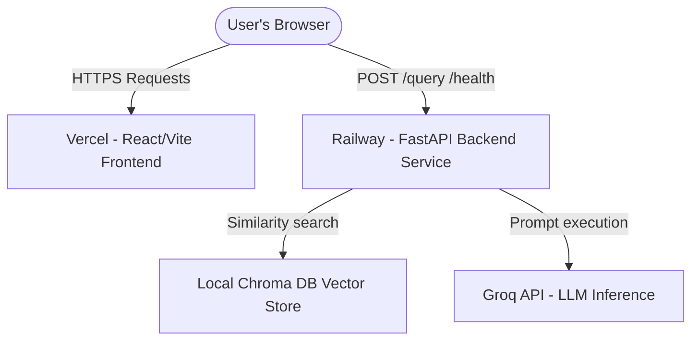

# Mutual Fund Assistant - Deployment Plan (Railway & Vercel)

This document provides step-by-step instructions to deploy the facts-only Mutual Fund RAG Assistant to production.

---

## Deployment Status Checklist

- [x] **FastAPI Backend (Railway)**: **SUCCESSFULLY DEPLOYED & ONLINE**
  - **Root Directory**: `backend`
  - **Start Command**: `python -m ingestion.download && python -m ingestion.parser && python -m ingestion.index && uvicorn main:app --host 0.0.0.0 --port $PORT`
  - **Public Domain**: [https://mutual-fund-assistant-rag-chat-bot-production.up.railway.app/](https://mutual-fund-assistant-rag-chat-bot-production.up.railway.app/)
- [x] **React Frontend (Vercel)**: **SUCCESSFULLY DEPLOYED & ONLINE**
  - **Root Directory**: `frontend`
  - **Framework Preset**: `Vite`
  - **Environment Variable**: `VITE_API_BASE_URL` = `mutual-fund-assistant-rag-chat-bot-production.up.railway.app`
  - **Public Domain**: [https://mutual-fund-assistant-rag-chat-bot.vercel.app/](https://mutual-fund-assistant-rag-chat-bot.vercel.app/)

---

## Deployment Architecture



---

## Part 1: Backend Deployment (Railway)

We deploy the FastAPI backend on Railway, which natively handles Python services, environment loading, and port routing.

### Step 1: Prepare Code Repository
Ensure your GitHub repository has the correct nested directory structure:
```text
├── backend/
│   ├── main.py
│   ├── requirements.txt
│   ├── ingestion/
│   │   ├── download.py
│   │   ├── parser.py
│   │   └── index.py
│   ├── raw_data/
│   ├── parsed_data/
│   └── ...
└── ...
```

### Step 2: Create Railway Service
1. Log in to your [Railway Dashboard](https://railway.app/).
2. Click **New Project** -> **Deploy from GitHub repository** and select your repository.
3. Once the service is created, go to the service **Settings** panel.

### Step 3: Configure Build & Start Commands
Since we nested the ingestion and data scripts under `/backend`, configure Railway to treat this subdirectory as the project root:

1. **Root Directory**: In Railway settings, click **Set root directory** and select/input `backend`.
2. **Custom Build Command**: Leave as default (Nixpacks detects `requirements.txt` automatically inside `/backend` and installs the packages).
3. **Custom Start Command**:
   Configure this start command to download, parse, and index the factsheets into Chroma DB before uvicorn boots the server:
   ```bash
   python -m ingestion.download && python -m ingestion.parser && python -m ingestion.index && uvicorn main:app --host 0.0.0.0 --port $PORT
   ```

### Step 4: Configure Environment Variables
Navigate to the **Variables** tab in your Railway service and add the following:

| Variable Name | Value | Purpose |
| :--- | :--- | :--- |
| `GROQ_API_KEY` | `gsk_...` | Your production Groq API access token. |
| `HOST` | `0.0.0.0` | Bind FastAPI server to accept public incoming queries. |
| `PORT` | `8000` (Assigned automatically by Railway) | The PORT uvicorn listens to. |

### Step 5: Expose Public Domain
1. In your Railway service dashboard, go to the **Settings** tab.
2. Under the **Public Networking** section, click **Generate Domain**.
3. Copy the generated domain (e.g. `https://your-backend-production.up.railway.app`). This is the URL that your React frontend will connect to.

---

## Part 2: Frontend Deployment (Vercel)

We deploy the React/Vite single-page application on Vercel for fast loading speeds, asset caching, and global edge routing.

### Step 1: Create Vercel Project
1. Log in to [Vercel](https://vercel.com/).
2. Click **Add New** -> **Project** -> Import your GitHub repository.

### Step 2: Configure Project Settings
In the configuration screen, apply the following project details:

1. **Framework Preset**: Select **Vite** from the dropdown list.
2. **Root Directory**: Edit and set this value to `frontend`.
3. **Build and Output Settings**: Leave these as default (Vite automatically handles `npm run build` producing `/dist`).

### Step 3: Add Environment Variables
In the **Environment Variables** section of the configuration screen, add the base API path:

| Key | Value | Purpose |
| :--- | :--- | :--- |
| `VITE_API_BASE_URL` | `mutual-fund-assistant-rag-chat-bot-production.up.railway.app` | The Railway public URL you generated in Part 1. |

> [!IMPORTANT]
> Ensure the Vercel environment variable value does **NOT** contain a trailing slash (e.g. use `/` at the end).

### Step 4: Deploy
Click **Deploy**. Vercel will build your static bundle and serve the app on a public domain (e.g. `https://mutual-fund-assistant-rag-chat-bot.vercel.app`).

---

## Part 3: Handshake Verification & Production Testing

Once both services are active, check that the setup was successful:

1. **Health Verification**:
   - Open your Vercel deployment URL in a browser.
   - Look at the top navigation bar. If the integration is successful, the indicator dot will pulse green, and the text will display `Connected (554 facts)` (or the exact number of parsed facts).
2. **Check Offline Fallback**:
   - If the indicator dot pulses red or says `Disconnected`, open your browser developer console (F12) to trace the failing fetch call to `https://mutual-fund-assistant-rag-chat-bot-production.up.railway.app/health`.
3. **Functional Query Testing**:
   - Click the **Exit Load Details** quick-start button.
   - The bot should instantly reply with exit load facts (1% within 1 year) and present the **View Reference Sheet** link button pointing to the official sources.
